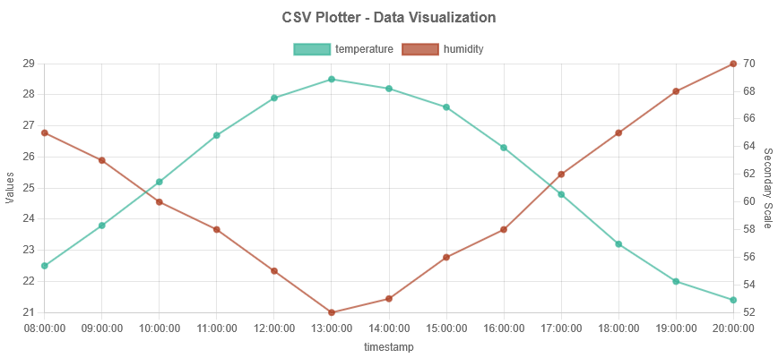
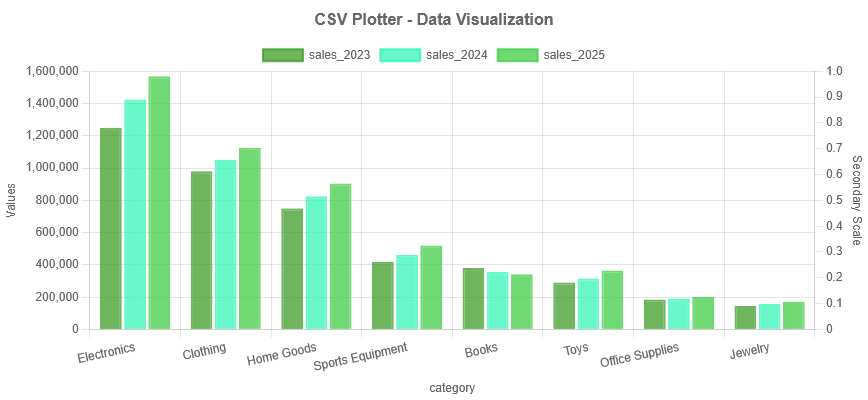
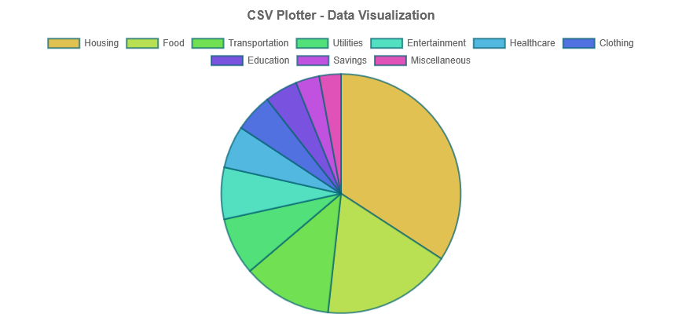
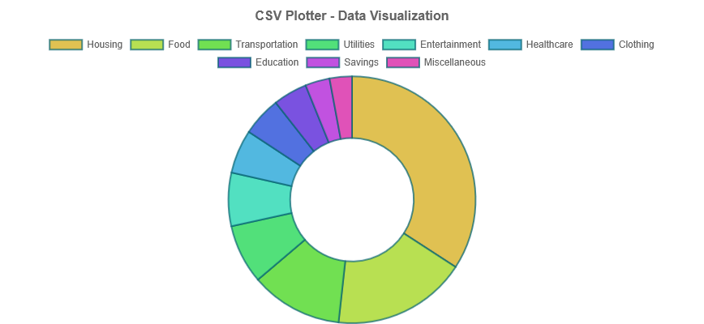
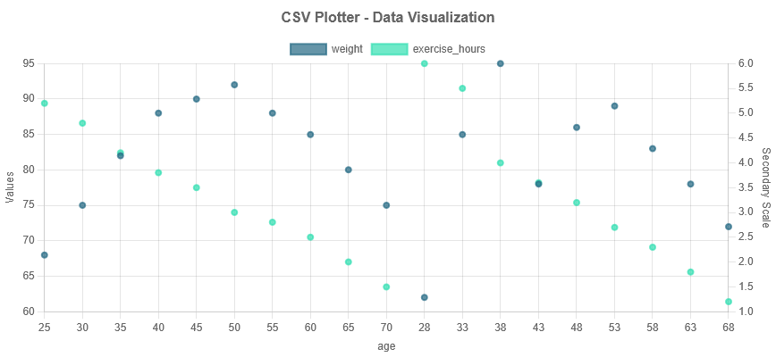
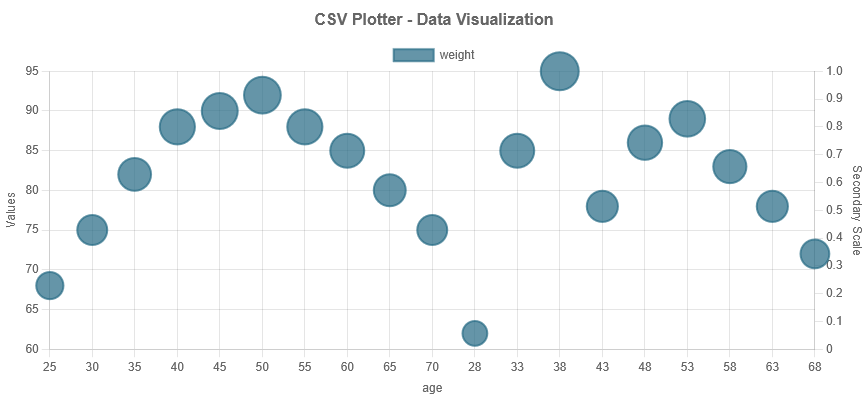
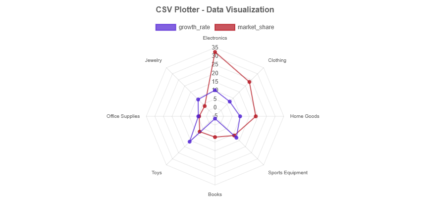
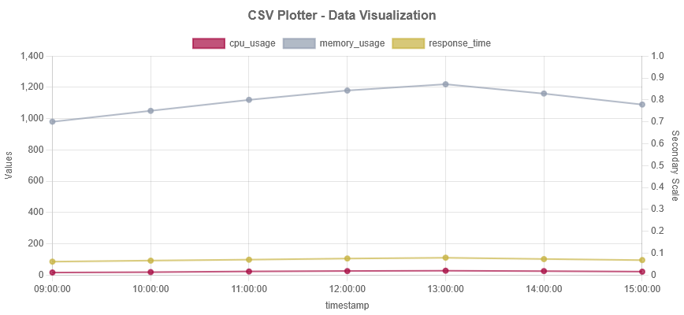

# Chart Visualization Guide

This guide provides step-by-step instructions for creating different types of visualizations with the sample data files. Each section includes a sample chart image showing what the visualization should look like when properly configured.

## 1. Line Chart with Time Series Data

**Sample File**: `time_series_data.csv`

**Steps**:

1. Upload the `time_series_data.csv` file
2. Select "timestamp" for the X-axis
3. Select "temperature" and "humidity" for Y-axis
4. Keep the default "line" chart type for both
5. Optional: Set "humidity" to use Secondary Y-axis
6. Click "Plot Selected Columns"

**What to Observe**:

- How the timestamp formatting improves readability
- The trends over time for both temperature and humidity
- How using a secondary Y-axis helps compare data with different scales

## 2. Bar Chart for Comparison

**Sample File**: `comparison_data.csv`

**Steps**:

1. Upload the `comparison_data.csv` file
2. Select "category" for the X-axis
3. Select "sales_2023", "sales_2024", and "sales_2025" for Y-axis
4. Change the chart type to "bar" for all selected columns
5. Choose different colors for each year to make them visually distinct
6. Click "Plot Selected Columns"

**What to Observe**:

- The sales comparison across different categories
- The year-over-year growth patterns
- How bar charts make it easy to compare values visually

## 3. Pie Chart for Distribution

**Sample File**: `distribution_data.csv`

**Steps**:

1. Upload the `distribution_data.csv` file
2. Select "expense_category" for the X-axis
3. Select only "percentage" for Y-axis (pie charts work best with a single data series)
4. Change the chart type to "pie"
5. Click "Plot Selected Columns"

**What to Observe**:

- How the pie chart shows the proportion of each expense category
- The automatic color assignment to different segments
- The interactive tooltip showing exact values

## 4. Doughnut Chart Alternative

**Sample File**: `distribution_data.csv`

**Steps**:

1. Follow the same steps as the pie chart example
2. Change the chart type to "doughnut" instead of "pie"
3. Click "Plot Selected Columns"

## 5. Scatter Plot for Correlation

**Sample File**: `correlation_data.csv`

**Steps**:

1. Upload the `correlation_data.csv` file
2. Select "age" for the X-axis
3. Select "weight" and "exercise_hours" for Y-axis
4. Change the chart type to "scatter" for both
5. Set "exercise_hours" to use Secondary Y-axis
6. Click "Plot Selected Columns"

**What to Observe**:

- The correlation between age and weight
- The inverse relationship between age and exercise hours
- How the scatter plot reveals patterns in the data

## 6. Bubble Chart for Multi-dimensional Analysis

**Sample File**: `correlation_data.csv`

**Steps**:

1. Upload the `correlation_data.csv` file
2. Select "age" for the X-axis
3. Select "weight" for Y-axis
4. Change the chart type to "bubble"
5. Click "Plot Selected Columns"

**What to Observe**:

- The bubble size automatically scales with the weight value
- How bubble charts can show three dimensions of data
- The interactive tooltips showing the data points

## 7. Radar Chart for Multi-variable Comparison

**Sample File**: `comparison_data.csv`

**Steps**:

1. Upload the `comparison_data.csv` file
2. Select "category" for the X-axis
3. Select "market_share" and "growth_rate" for Y-axis
4. Change the chart type to "radar" for both selections
5. Click "Plot Selected Columns"

**What to Observe**:

- How radar charts compare multiple variables across categories
- The shape of the radar gives quick visual insights
- Different variables can be toggled on/off in the legend

**Note**: Radar charts require all selected Y-axis columns to use the 'radar' chart type. Mixing radar with other chart types is not supported.

## 8. Application Filtering

**Sample File**: `application_metrics.csv`

**Steps**:

1. Upload the `application_metrics.csv` file
2. Notice the application filter dropdown appears automatically
3. Select "timestamp" for the X-axis
4. Select "cpu_usage", "memory_usage", and "response_time" for Y-axis
5. Keep the default "line" chart type
6. Click "Plot Selected Columns"
7. Try selecting different applications from the filter dropdown

**What to Observe**:

- How the filter instantly updates the chart with data for the selected application
- The different performance patterns across applications
- How the application filter makes it easy to focus on specific data

